<div align="center">

# ThumbGen

**A self-hosted, node-based YouTube thumbnail studio with an AI agent that builds the workflow with you.**

Wire a character, reference images, logos and prompts into a generator on an infinite canvas, A/B/C-test variants, study which thumbnails perform on the channels you follow, and let the agent interview you and lay out the canvas live. Everything runs on your machine, with your data in one SQLite file.


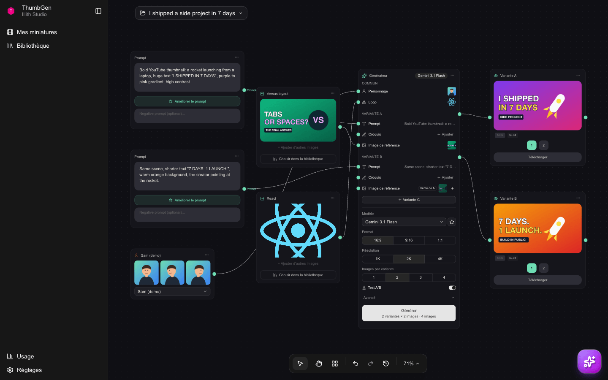

</div>

> [!NOTE]
> The interface is in French (« Mes miniatures », « Bibliothèque », « Réglages »…). The agent can answer in French, English, Spanish, German, Portuguese or Italian (Réglages → Agent IA).
>
> All screenshots use demo data: an illustrated character and generated placeholder thumbnails.

## Contents

- [Features](#features)
  - [Canvas and nodes](#canvas-and-nodes)
  - [Generator and A/B/C tests](#generator-and-abc-tests)
  - [AI agent](#ai-agent)
  - [Bibliothèque (library)](#bibliothèque-library)
  - [Réglages (settings)](#réglages-settings)
  - [MCP server](#mcp-server)
- [Quick start with Docker](#quick-start-with-docker)
- [Local development without Docker](#local-development-without-docker)
- [Configuration](#configuration)
- [Costs](#costs)
- [Connecting an MCP client](#connecting-an-mcp-client)
- [Architecture](#architecture)
- [Troubleshooting](#troubleshooting)
- [Contributing](#contributing)
- [License](#license)

## Features

### Canvas and nodes

Each video is a project (« miniature ») with its own canvas. The gallery lists them, most recently edited first, with the number of thumbnails each has produced.

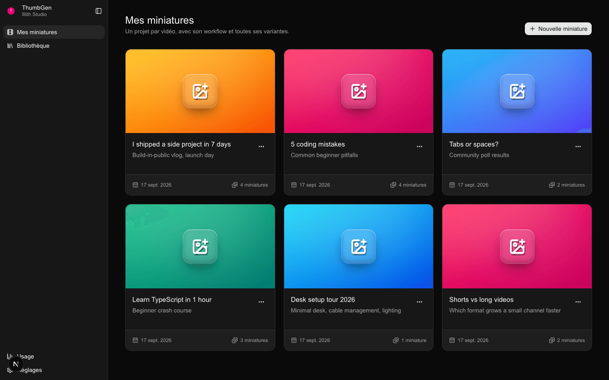

Build a thumbnail by connecting nodes:

| Node | What it does |
|------|--------------|
| **Prompt** | Describes the thumbnail. « Améliorer le prompt » rewrites it with an LLM. |
| **Personnage** | A reusable character with up to three angles (front, left, right), picked from the library. |
| **Image de référence** | A style or composition reference: upload, paste, or pick from the library. |
| **Logo** | A logo to place in the thumbnail. Image and logo nodes can remove the background in the browser. |
| **Croquis** | A hand-drawn layout sketch (Excalidraw editor). |
| **Générateur** | Sends the connected inputs to an image model (see below). |
| **Texte overlay** | Adds text on top of a generated image. |
| **Aperçu** | Shows results with timing and estimated cost, lets you pick and download. |

Add steps from the « Ajouter une étape » panel: press <kbd>N</kbd>, right-click, or drop a wire on empty canvas (the list is then filtered to compatible nodes). Other shortcuts: <kbd>⌘A</kbd> select all, <kbd>⌘D</kbd> duplicate, <kbd>⇧⌥T</kbd> auto-layout, <kbd>⌘Z</kbd> / <kbd>⇧⌘Z</kbd> undo/redo, <kbd>⌘1</kbd> fit to screen. Canvases save automatically.

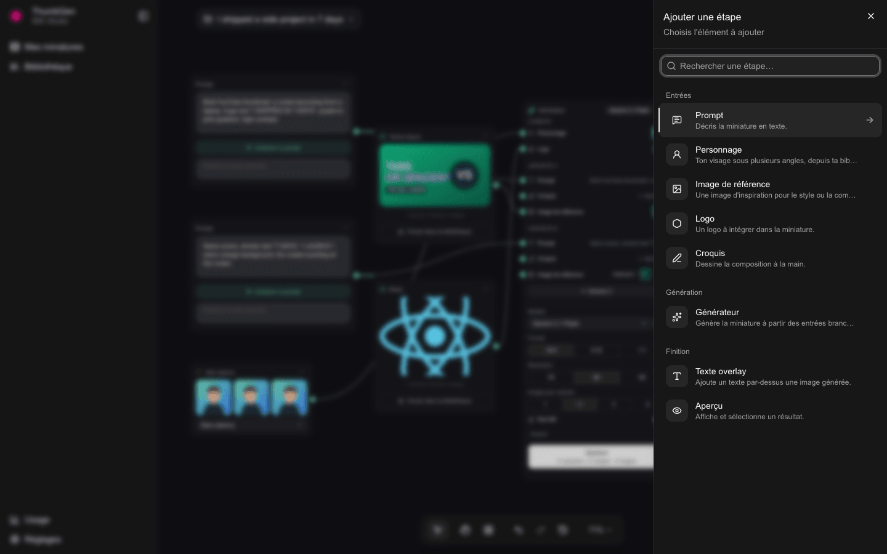

### Generator and A/B/C tests

The generator lays out its inputs as rows you can fill in place (« + Ajouter »), and exposes model, format (16:9, 9:16, 1:1), resolution (1K / 2K / 4K) and image count. The button always shows what a click will produce.

Turn on **Test A/B** to create up to three variants (A, B, C), the maximum YouTube Studio's « Test & compare » accepts. The character and logo are shared. Each variant can override the prompt, sketch and reference image; empty inputs inherit from variant A (« hérité de A »). Each variant gets its own output. « Avancé » also lets you compare several models on the same inputs.

<p align="center">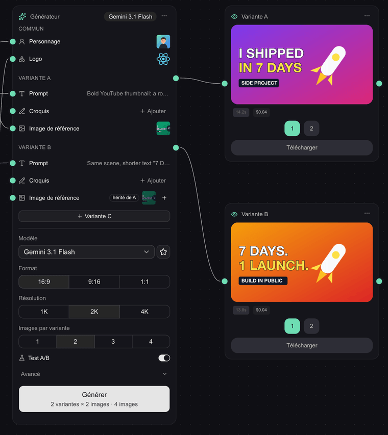</p>

All image models go through [OpenRouter](https://openrouter.ai)'s image API with a single key: Gemini 3 Pro, 3.1 Flash, 3.1 Flash Lite and 2.5 Flash; GPT Image 2.5 Sunburst, 2.5 Flare, 2 and 1; and Seedream 4.5. The generator warns you before a run if the chosen model can't use a connected character reference.

### AI agent

Open the chat from the button at the bottom right of a canvas. The agent runs on OpenRouter; pick the model in Réglages → Agent IA (Claude Sonnet 4.6 by default; Claude Opus 4.7, Gemini 3.8 Flash, Gemini 3.1 Pro and GPT-5 are also available). You can type, attach or paste images, pick from the library, or dictate a voice note.

**Guided interview.** On an empty conversation, « Construire avec l'agent » starts an eight-question interview: video, angle, character, references, logos, text, mood, model. You answer with clickable choices, thumbnails, « Autre » (free text) or « Passer », and each answer places or updates its node on the canvas **live**. Typing a message instead leaves the interview, which is how you go back or stop.

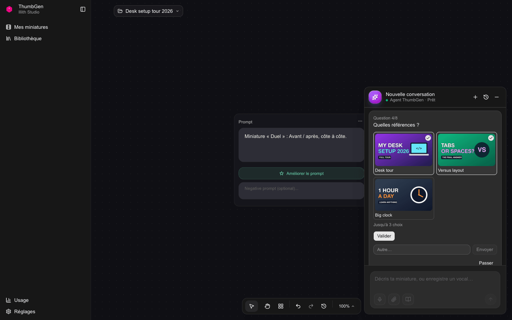

**Clean turns.** While it works, the agent shows one status line with a timer, expandable to the full detail (reasoning, tool calls). It ends each turn with a short summary, the results, and up to three « Et maintenant » actions. Generating is always a button *you* click, with the image count and estimated cost computed by the app.

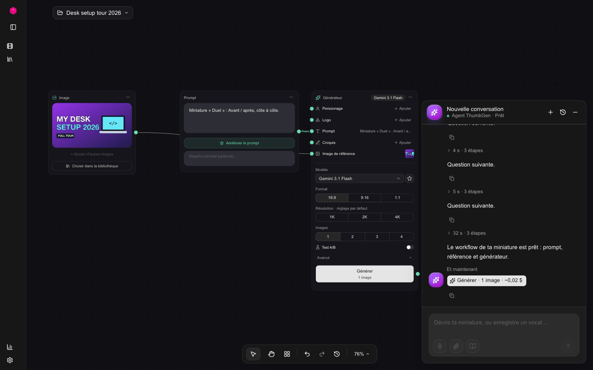

**Background runs.** A turn keeps running on the server if you leave the page or close the tab (one turn per conversation). The gallery marks projects where the agent is working, and a toast tells you when it finishes, fails or asks a question. Come back and the chat reconnects to the live turn. Turns do not survive a server restart.

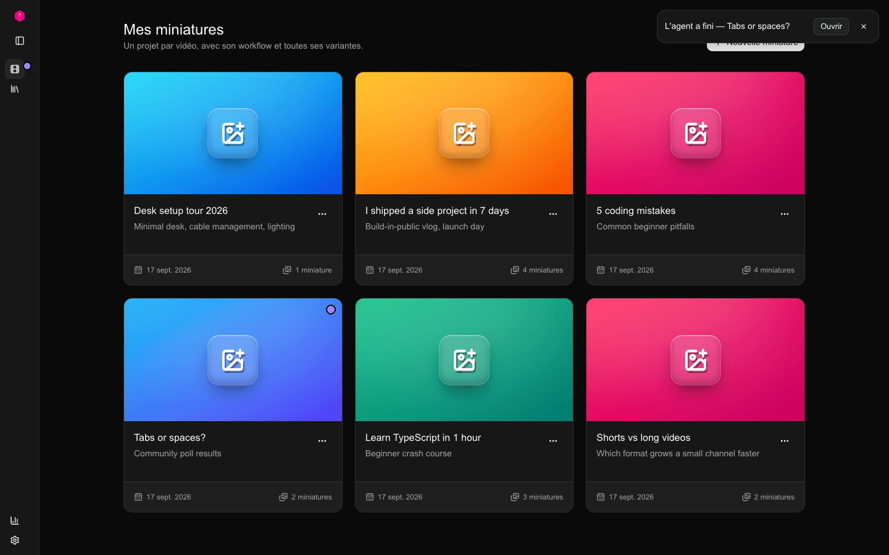

**Sees your canvas, doesn't break it.** The agent can look at every image on the canvas (sketches, references, logos, character, generated images) before changing anything. Its edits are non-destructive: nodes it wasn't asked to touch stay, and deletions must be explicit. Before each write, ThumbGen takes a snapshot, and « Historique de l'agent » in the bottom toolbar restores any of them.

<p align="center">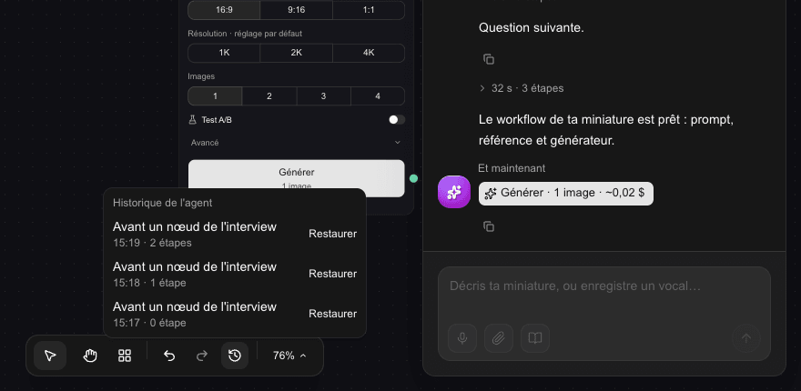</p>

Tools available to the agent:

| Tool | Purpose |
|------|---------|
| `get_canvas_state`, `view_canvas_images` | Read the workflow and look at its images |
| `apply_workflow` | Create or update nodes and edges (non-destructive merge, explicit `remove_node_ids`) |
| `list_projects`, `list_past_generations` | Browse projects and previous outputs |
| `list_personas`, `list_logos`, `list_swipe_files` | Browse the library |
| `generate_sketch` | Quick draft image (Gemini 2.5 Flash Image) to test an idea |
| `search_youtube`, `search_youtube_channel`, `get_channel_videos` | YouTube Data API research (uses YouTube quota) |
| `extract_youtube_script` | Fetch a video transcript |
| `import_youtube_thumbnail` | Copy a video's thumbnail into the library as a reference |
| `list_followed_videos` *(chat only)* | Followed-channel videos ranked by date or performance score |

Web search (OpenRouter's search option) can be turned on or off in Réglages → Agent IA. In the chat, the agent can also ask you for an image, a sketch or a multiple-choice answer.

### Bibliothèque (library)

One page, three tabs:

- **Personnages**: characters with up to three angles, imported per angle or captured with the webcam. Rename, replace an angle, delete.
- **Logos**: search Simple Icons, SVGL and Wikimedia Commons without any key, or import your own. With an optional [Brandfetch](https://brandfetch.com/developers) Client ID, Brandfetch results show up too; they link out and are never stored, per Brandfetch's terms.
- **Inspirations**: your imported reference images, plus **followed YouTube channels**.

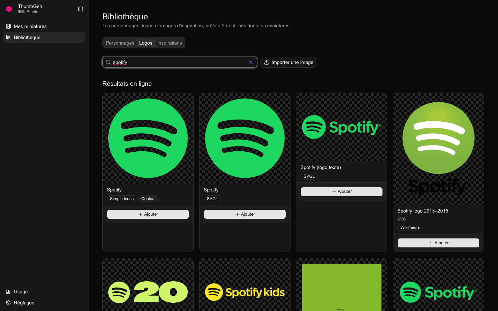

Follow your channel and others by URL, `@handle` or channel ID (needs a YouTube Data API key). ThumbGen imports the full history of long videos (no Shorts), keeps views up to date, and computes a **performance score**: views ÷ the channel's median views (last 50 videos older than 7 days). ×3 and above counts as overperforming, below ×0.5 as underperforming. Gemini 2.5 Flash Lite classifies thumbnails by type (face + text, before/after, versus, screenshot…), and you can correct any type by hand. « Les types qui marchent » ranks types by median score.

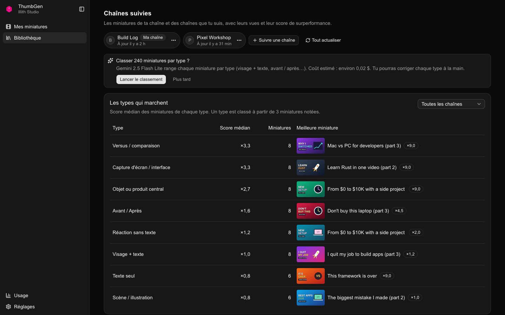

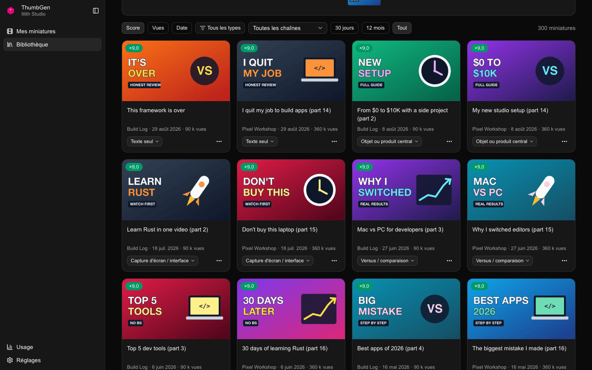

Filter by channel, type and period, sort by score, views or date, and use « Utiliser comme référence » to drop a thumbnail into a project.

### Réglages (settings)

| Section | What you set |
|---------|--------------|
| Connexions des modèles | OpenRouter, OpenAI, YouTube Data API and Brandfetch keys, each with a « Tester » button |
| Agent IA | Model, web search, reasoning effort, max steps, auto titles, response language |
| Génération d'images | Favourite model, default format, image count and resolution, automatic thumbnail classification |
| Ma chaîne | Channel name, niche, audience, tone, brand colours, default character, extra instructions for the agent |
| Intégrations | MCP server key and a ready-to-copy client config; password protection status |
| Données & sauvegardes | Storage usage, one-click backups (download or delete), cleanup |
| Apparence | Dark (default), light or system theme |

Keys entered here are stored in the local database and never sent to the browser (it only gets a `…abcd` preview). A key saved in Réglages takes precedence over the environment variable. The **Usage** page tracks generations, images, tokens, estimated cost per model and errors over time.

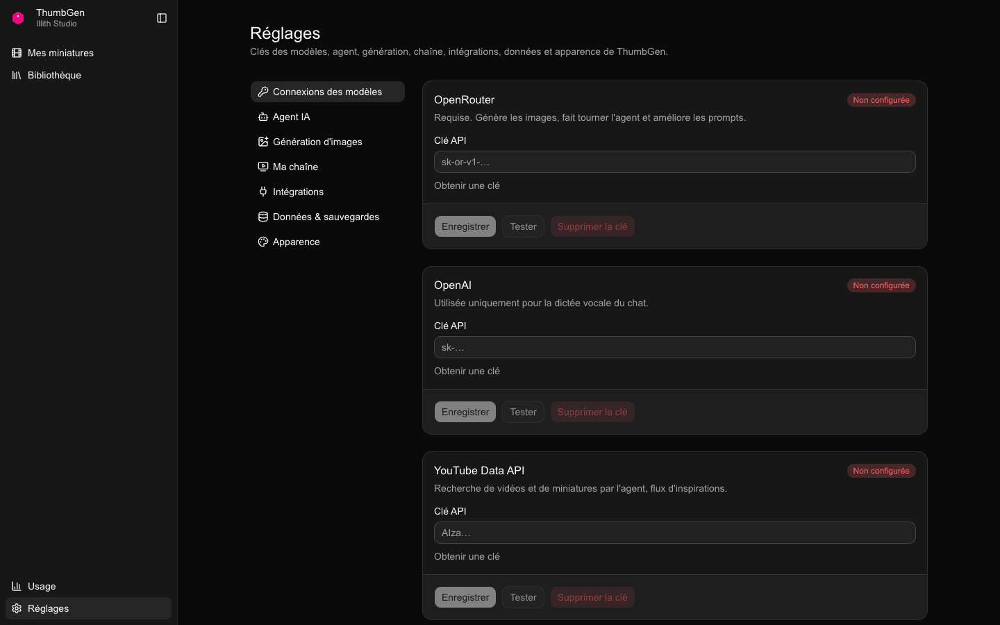

### MCP server

ThumbGen exposes its agent tools over the [Model Context Protocol](https://modelcontextprotocol.io) at `/api/mcp` (streamable HTTP, bearer token), so Claude Desktop, Claude Code, Cursor and other MCP clients can read and build your canvases. See [Connecting an MCP client](#connecting-an-mcp-client).

## Quick start with Docker

**Prerequisites:** [Docker](https://docs.docker.com/get-docker/) with Docker Compose, Git, and an [OpenRouter API key](https://openrouter.ai/keys). The key is needed for generation, the agent and prompt enhancement, and you can add it after starting.

```bash
git clone https://github.com/ohvignas/ThumbGen.git
cd ThumbGen

# Optional: put your keys in .env (or leave them empty and use Réglages later)
cat > .env <<'EOF'
OPENROUTER_API_KEY=
OPENAI_API_KEY=
YOUTUBE_API_KEY=
MCP_API_KEY=
SITE_PASSWORD=
EOF

docker compose up -d --build
```

Open **http://localhost:3000**. You land on « Mes miniatures ». If you left `.env` empty, go to **Réglages → Connexions des modèles**, paste your OpenRouter key, then click « Enregistrer » and « Tester ».

- **Port:** the container listens on `127.0.0.1:3000` only, so other machines can't reach it. Edit `ports` in `docker-compose.yml` to change that.
- **Data:** everything (projects, library, generated images, chats, settings, keys saved in Réglages) lives in `./data/thumbgen.db`, bind-mounted into the container. In-app backups go to `./data/backups/`.
- **Logs:** `docker logs -f thumbgen`
- **Stop:** `docker compose down` (your data stays in `./data`)

**Update**

```bash
git pull
docker compose up -d --build
```

The database schema is created and migrated automatically on start.

**Back up**

Use **Réglages → Données & sauvegardes** to create and download a consistent backup while the app runs. Or stop the container and copy the whole `data/` folder (SQLite runs in WAL mode: if `thumbgen.db-wal` and `thumbgen.db-shm` exist, copy them with the `.db`).

> [!IMPORTANT]
> `OPENAI_API_KEY`, `YOUTUBE_API_KEY` and `SITE_PASSWORD` are also passed as build arguments. After changing `.env`, run `docker compose up -d --build`, not just `restart`.

## Local development without Docker

**Prerequisites:** Node.js 20 or newer (the Docker image uses `node:20`) and npm. `better-sqlite3` ships prebuilt binaries for common platforms; on others it needs Python 3, `make` and a C++ compiler.

```bash
git clone https://github.com/ohvignas/ThumbGen.git
cd ThumbGen
npm install
npm run dev          # http://localhost:3000
```

Put keys in `.env.local` (same variable names as the [Configuration](#configuration) table) or in Réglages. The dev server uses `data/thumbgen.db` by default. Set `THUMBGEN_DB_PATH=/some/other/file.db` to work on a separate database.

| Command | What it does |
|---------|--------------|
| `npm run dev` | Next.js dev server |
| `npm run build` / `npm start` | Production build (standalone output) and server |
| `npm test` | Runs the unit tests once (Vitest, happy-dom) |
| `npm run test:watch` | Vitest in watch mode |
| `npm run lint` | ESLint (`eslint-config-next`) |
| `npx tsc --noEmit` | Type check (no dedicated script) |
| `npm run migrate` | One-off import of the legacy JSON storage into SQLite |

## Configuration

You only need OpenRouter to generate. Every secret can be set **either** as an environment variable **or** in Réglages; a value saved in Réglages wins. All other settings live only in Réglages.

| Variable | Réglages | Required | Enables | Where to get it |
|----------|----------|----------|---------|-----------------|
| `OPENROUTER_API_KEY` | Connexions → OpenRouter | **Yes** (to generate) | Image generation, AI agent, « Améliorer le prompt », thumbnail classification | [openrouter.ai/keys](https://openrouter.ai/keys) |
| `OPENAI_API_KEY` | Connexions → OpenAI | No | Voice dictation in the chat (`gpt-4o-mini-transcribe`) | [platform.openai.com/api-keys](https://platform.openai.com/api-keys) |
| `YOUTUBE_API_KEY` | Connexions → YouTube Data API | No | Followed channels, performance scores, agent YouTube research | Google Cloud Console → enable **YouTube Data API v3** → Credentials → API key ([guide](https://developers.google.com/youtube/v3/getting-started)) |
| `BRANDFETCH_API_KEY` | Connexions → Brandfetch | No | Brandfetch results in the logo search | Free developer account at [brandfetch.com/developers](https://brandfetch.com/developers) (« Client ID ») |
| `MCP_API_KEY` | Intégrations → Serveur MCP | No | Bearer token for `/api/mcp`. Generated on first use if unset; can be regenerated in Réglages | Any long random string |
| `SITE_PASSWORD` | *(env only)* | No | Password gate for the whole app (except `/api/mcp`, which uses its bearer token) | Choose one |
| `THUMBGEN_PUBLIC_HOST` | *(env only)* | No | Extra hostname allowed by the MCP server's Origin check (default: localhost only) | Your domain, without scheme or port |
| `THUMBGEN_DB_PATH` | *(env only)* | No | Alternative SQLite file (default `data/thumbgen.db`) | A file path |

`docker-compose.yml` passes `OPENROUTER_API_KEY`, `OPENAI_API_KEY`, `YOUTUBE_API_KEY`, `MCP_API_KEY` and `SITE_PASSWORD` into the container. With Docker, set the Brandfetch key in Réglages, or add `BRANDFETCH_API_KEY` / `THUMBGEN_PUBLIC_HOST` to the `environment:` list.

## Costs

ThumbGen is free and self-hosted. The providers you connect bill you directly.

**Paid, only when you click « Générer »:** image generation through OpenRouter. The app's per-image estimates (`src/lib/model-costs.ts`):

| Model | ≈ per image |
|-------|-------------|
| Gemini 3.1 Flash Lite | $0.01 |
| Gemini 3.1 Flash *(default)*, Gemini 2.5 Flash, GPT Image 1, Seedream 4.5 | $0.02 |
| GPT Image 2.5 Flare | $0.03 |
| Gemini 3 Pro, GPT Image 2 | $0.04 |
| GPT Image 2.5 Sunburst | $0.05 |

A/B tests multiply by variants × images; the generator button shows the total before you click.

**Paid when you send a message to the agent:** each turn uses tokens on the model you chose. Prices per million input/output tokens: Gemini 3.8 Flash $0.75/$3.75, Gemini 3.1 Pro $2/$12, Claude Sonnet 4.6 $3/$15, GPT-5 $5/$15, Claude Opus 4.7 $15/$75. A turn may also call `generate_sketch` (≈ $0.02 per draft) and web search. The agent never starts a final generation on its own.

**Other small costs:**

- « Améliorer le prompt »: one Gemini 3.8 Flash call per click.
- Voice dictation: billed by OpenAI.
- Thumbnail-type classification: Gemini 2.5 Flash Lite, about $0.02 per few hundred thumbnails. It runs automatically on new imports unless you turn it off in Réglages → Génération d'images, and asks for confirmation above 200 thumbnails.

**Free but quota-limited:** YouTube Data API (10,000 units a day by default). Syncing about 1,000 videos uses roughly 40 units; each agent `search_youtube` / `search_youtube_channel` call uses 100.

All figures are estimates, so check the providers' current pricing. The **Usage** page shows what you actually spent on generation.

## Connecting an MCP client

1. Open **Réglages → Intégrations → Serveur MCP**, then reveal and copy the key. It is created on first use, or set `MCP_API_KEY` yourself.
2. Point your client at `http://localhost:3000/api/mcp` with `Authorization: Bearer <key>`.

**Claude Code**

```bash
claude mcp add --transport http thumbgen http://localhost:3000/api/mcp \
  --header "Authorization: Bearer <your-key>"
```

**Claude Desktop and other clients:** Réglages shows a ready-to-copy JSON config:

```json
{
  "mcpServers": {
    "thumbgen": {
      "url": "http://localhost:3000/api/mcp",
      "auth": { "type": "bearer", "token": "<your-key>" }
    }
  }
}
```

Every agent tool listed [above](#ai-agent) is exposed except the chat-only ones: `list_followed_videos`, the interview and turn-summary tools, and the in-chat requests for an image, sketch or answer.

**Remote access:** by default the server only accepts requests with no `Origin` header or a localhost `Origin`. To use it from another device, put ThumbGen behind HTTPS (Tailscale Serve, ngrok, a reverse proxy…) and set `THUMBGEN_PUBLIC_HOST=your.host.example`. The bearer token is the only protection on `/api/mcp`, so never expose it over plain HTTP.

## Architecture

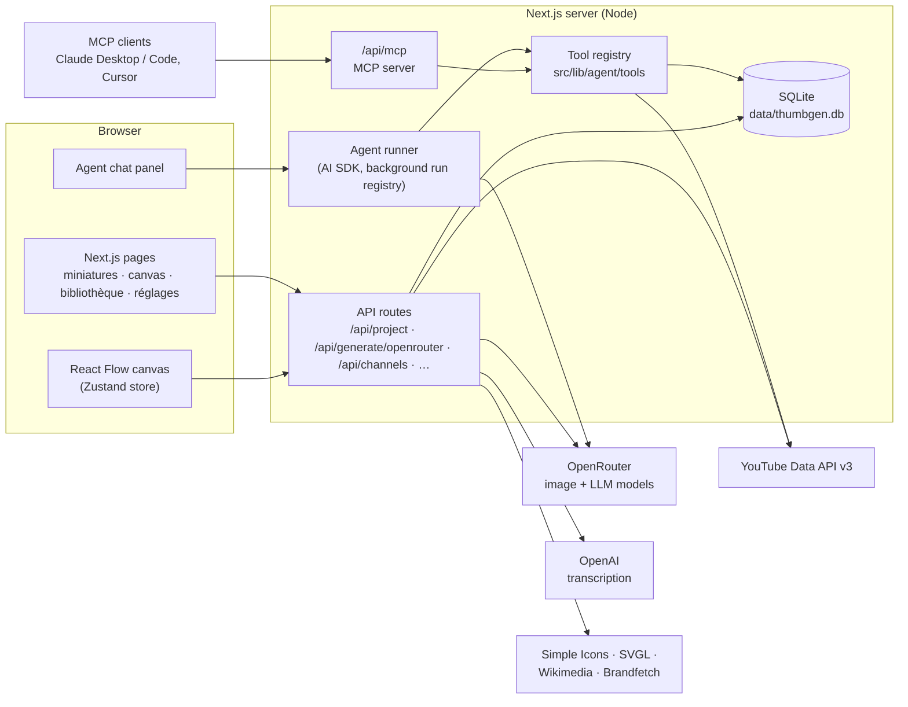

- **Single process, single file.** The Next.js app serves the UI and the API. `better-sqlite3` stores projects, canvases, library images, generated images, conversations, snapshots, followed channels and settings in `data/thumbgen.db`.
- **One tool registry, two entry points.** Agent tools live in `src/lib/agent/tools/`. The in-app agent (`src/lib/agent/v2/`) and the MCP server (`src/lib/agent/mcp/server.ts`) both use them.
- **Background runs.** Agent turns run in an in-memory registry (`src/lib/agent/v2/run-registry.ts`), separate from the HTTP request. The browser subscribes to a turn's stream and can reconnect later.

**Project structure**

```
src/
├── app/                  # Pages (miniatures, m/[id], bibliotheque, reglages/*, usage) and API routes
├── components/
│   ├── Canvas.tsx        # React Flow canvas
│   ├── nodes/            # Prompt, Personnage, image/logo, Croquis, Générateur, Aperçu, Texte overlay
│   ├── panels/           # Sidebar, node picker, chat panel, agent history, zoom bar
│   ├── library/          # Bibliothèque tabs, logo search, followed channels
│   ├── settings/         # Réglages sections
│   └── ui/               # shadcn/ui components
├── lib/
│   ├── agent/            # Agent runner, tools, MCP server, system prompt
│   ├── canvas/           # Node catalog, A/B variants, shortcuts, canvas patches
│   ├── youtube/          # Channel sync, performance score, classification
│   ├── logos/            # Logo search providers
│   ├── db.ts             # SQLite schema and migrations
│   └── settings*.ts      # Settings schema (zod) and storage
├── store/                # Zustand stores
└── middleware.ts         # Optional SITE_PASSWORD gate
tests/                    # Vitest suites
docs/superpowers/specs/   # Design notes for each feature
```

**Tech stack:** Next.js 16 (App Router, standalone output), React 19, TypeScript, Tailwind CSS v4 and shadcn/ui (Base UI), @xyflow/react, Zustand, Vercel AI SDK with the OpenRouter provider, @modelcontextprotocol/sdk, better-sqlite3, zod, Excalidraw, @imgly/background-removal, Vitest.

## Troubleshooting

**Port 3000 is already in use.** Change the host side of the mapping in `docker-compose.yml` (for example `"127.0.0.1:3001:3000"`), or run the dev server with `npm run dev -- -p 3001`. If you use MCP, update the client URL too.

**« Non configurée », or the generator or agent says a key is missing.** Add the key in Réglages → Connexions des modèles and click « Tester ». With Docker and `.env`, make sure you rebuilt (`docker compose up -d --build`). A key saved in Réglages overrides the environment one.

**Followed channels ask for a YouTube key, or stop with « Quota YouTube atteint ».** Add a YouTube Data API v3 key. When the daily quota runs out, sync stops cleanly and resumes the next day.

**The Docker build fails or gets killed.** `next build` needs memory: give Docker Desktop at least 4 GB (Settings → Resources). If `npm ci` fails compiling `better-sqlite3`, check that the build has network access; the Dockerfile already installs `python3`, `make` and `g++`.

**Login loops with `SITE_PASSWORD`.** The auth cookie is `Secure`, so browsers only keep it over HTTPS or on `localhost`. Put the app behind HTTPS if you open it from another machine.

**An MCP client gets 401 or 403.** 401: the key is wrong or was regenerated, so copy it again from Réglages → Intégrations. 403: the request came from a non-localhost `Origin`, so set `THUMBGEN_PUBLIC_HOST`.

**An agent change went wrong.** Open « Historique de l'agent » (clock icon in the bottom toolbar) and click « Restaurer » on an earlier snapshot. <kbd>⌘Z</kbd> also undoes recent canvas edits.

**Start over with empty data.** Stop the app, move the `data/` folder somewhere safe (keep it until you're sure), and start again. A fresh database is created on launch.

## Contributing

Issues and pull requests are welcome.

1. Fork the repo and create a branch from `main`.
2. Run `npm install`, then `npm run dev`. Use `THUMBGEN_DB_PATH` to keep test data away from your real database.
3. Before opening a PR, run `npm test`, `npm run lint` and `npx tsc --noEmit`.
4. Feature design notes live in `docs/superpowers/specs/`. Describe any user-visible change in the PR.

Never commit `.env*` files or anything from `data/`: they hold API keys and your images.

## License

[MIT](LICENSE). ThumbGen started as a fork of [per-simmons/thumbgen](https://github.com/per-simmons/thumbgen) and has since been largely rewritten.
